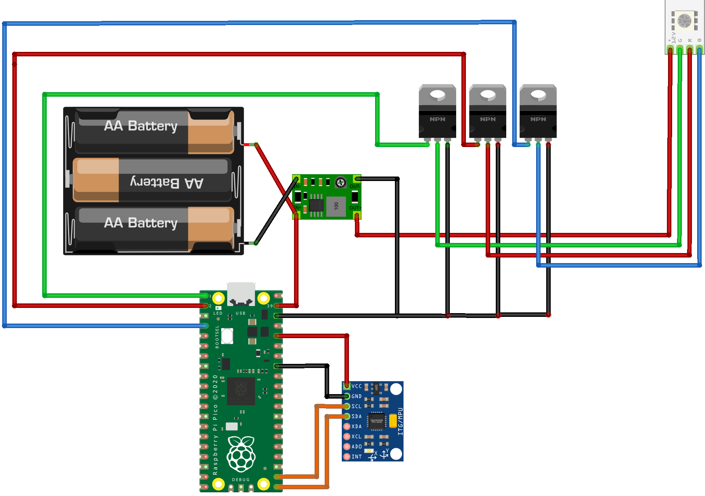
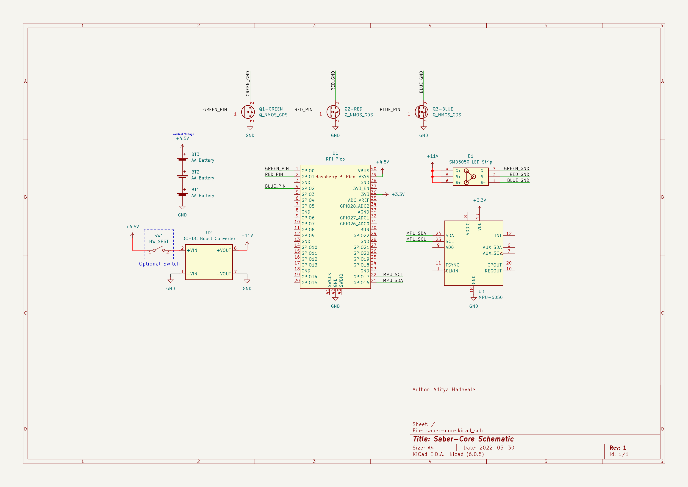

# Saber-Core

This project utilizes the Raspberry Pi Pico microcontroller alongside a MPU-6050 chip to create a lightsaber using PlatformIO/VS Code with earlephilhower's [arduino-pico core](https://github.com/earlephilhower/arduino-pico).

The [MPU6050_light](https://github.com/rfetick/MPU6050_light) library is used to get orientation data.

##  Getting Started

These steps were written to try to be platform-agnostic, but may need to be modified for your needs.
This software should work without modification if the [wiring guide](#wiring-guide) is followed.

###  Prerequisites

 - Software: [Visual Studio Code](https://code.visualstudio.com/download), [PlatformIO Extension](https://marketplace.visualstudio.com/items?itemName=platformio.platformio-ide)

###  Installation

1. Clone the repo:

```bash
git clone https://github.com/adih-20/saber-core.git
```
 2. Import ```saber-core``` into PlatformIO/VSCode.
 
 3. Build and upload to Pico.

##  Usage

When switched on, the lightsaber should glow blue. 

To switch colors, hold the lightsaber upside down (with the hilt facing the sky) for five seconds, which will cause the colors (Red, Orange, Green, Blue, Cyan, Purple, White) to switch every two seconds.

The software has an inbuilt watchdog to check for I2C communication errors with the MPU-6050. If any occur, the lightsaber will begin flashing red, indicating that the lightsaber must be manually restarted.

## Materials
This project uses the following components:

 1. [Raspberry Pi Pico](https://www.raspberrypi.com/products/raspberry-pi-pico/) microcontroller

 2. [MPU-6050](https://invensense.tdk.com/products/motion-tracking/6-axis/mpu-6050/) Accelerometer/Gyroscope

 3. SMD5050 LED Strip (**not** the NeoPixel!)

 4. 3x Logic Level N-MOSFET (I used the [FQU13N10LTU](https://www.onsemi.com/products/discrete-power-modules/mosfets/fqu13n10l), though you are welcome to use any other)
 
 5. DC-DC Boost Converter (make sure it **steps up** the voltage, not steps down)

 6. 3x AA batteries

**OPTIONAL**

 7. SPST switch (strongly recommended to switch lightsaber on and off)

##  Wiring Guide
*Wiring Diagram (Fritzing)*


*Schematic (KiCAD)*


If you change any of the connections (with the exception of ground), make sure to update the code with your changes!

##  Roadmap

High-priority:
- [ ] Add over-temperature protection

Low-priority:
- [ ] Add flash-to-crash functionality
- [ ] Implement audio output

##  License

This project is licensed under the [GPLv3](LICENSE).